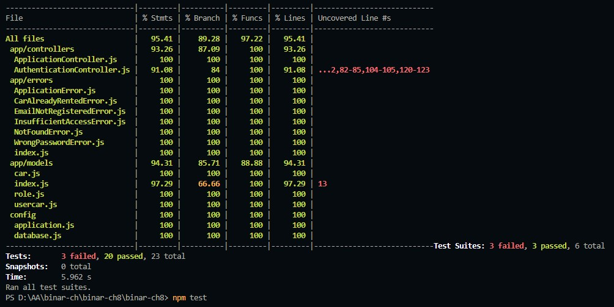

# binar-ch8

Unit and integration tests for this project is built using `jest` and `supertest`.

## Live Application

This application is currently deployed using [railway.app](railway.app).  
You can access this application on [https://binar-ch8-production.up.railway.app/](https://binar-ch8-production.up.railway.app/) 

## Setup Local Server and Database

Run this command to install all dependencies needed by this project:

    npm install

run this command to setup database with sequelize, Remember to setup `database` first:

    npm run db:setup

## Running Server
    
run this command to start express server in development mode:

    npm run start

To run both unit and integration tests, use this command:

    npm test
    

## API Docs

| Route            |  Local Full URL           | Full URL Link                                                     |
| ---------------- | ---------------------------- | ------------------------------------------------------------- |
| `/documentation` | localhost:8000/documentation | https://binar-ch8-production.up.railway.app/documentation/ |

### Test Coverage

Unit and integration tests coverage of this project can be seen on this image below:

